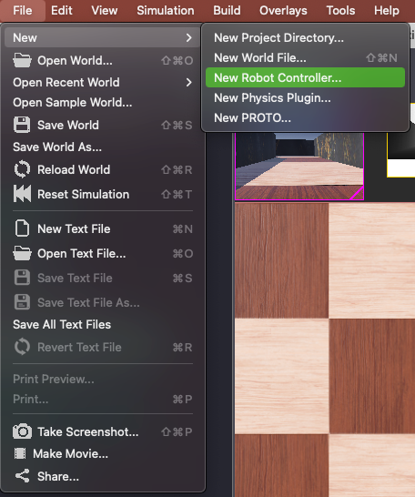
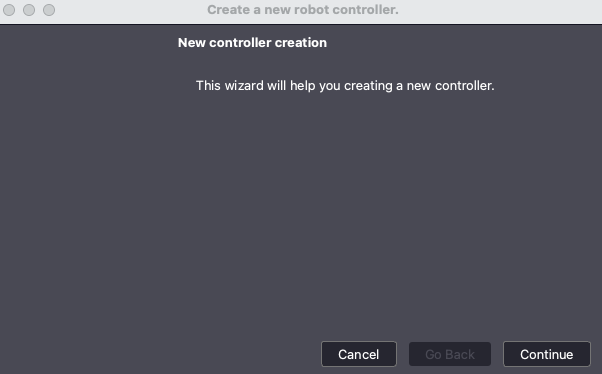
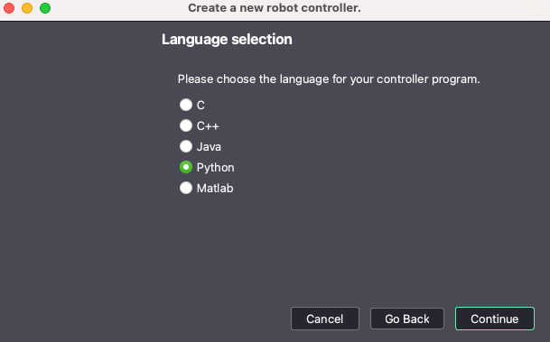
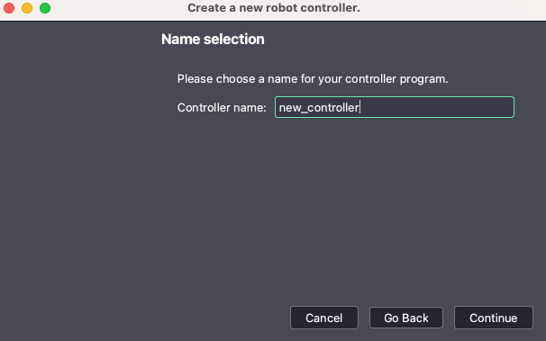
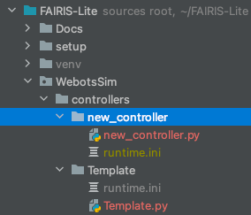
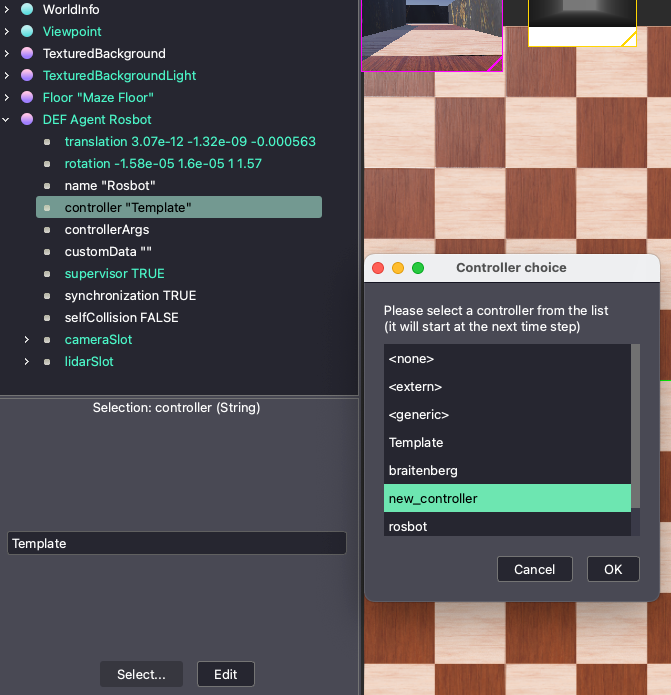

# Webot Robot Controllers
FAIRIS uses python scripts that will be utilized by Webots to control the simulated robot. You can find more 
details in [Webots Documentation](https://cyberbotics.com/doc/guide/controller-programming?tab-language=python). 
FAIRIS provides a template and libraries that stream lines the development of robot controller, however you 
will still need to create new controllers. Below are the steps you will need to follow inorder to create a new Robot 
Controller.

## World Launch Fix (macOS)

If imported worlds reference `webots://projects/...` assets and render as unknown nodes,
your local Webots install may not include those project assets on disk.

In this repository, the `city` and `village` worlds were normalized to use direct
Cyberbotics raw URLs (`https://raw.githubusercontent.com/.../R2025a/projects/...`),
so they no longer depend on local `webots://` path resolution.

Use the launcher script to enforce the correct macOS path:

```bash
./scripts/open_world.sh worlds/city/city.wbt
./scripts/open_world.sh worlds/city/city_night.wbt
./scripts/open_world.sh worlds/village/village.wbt
./scripts/open_world.sh worlds/village/village_winter.wbt
```

The launcher script can still enforce a sane `WEBOTS_HOME` on macOS:

```bash
WEBOTS_HOME=/Applications/Webots.app/Contents
```

which is required on macOS app bundles.  
If your IDE sets `WEBOTS_HOME` to `/Applications/Webots.app`, remove that override.

## City Dataset Collection (SeqSLAM-style)

To collect a route dataset from the `city` / `city_night` worlds using teleport poses:

1. Open `Simulator/Webots/worlds/city/city.wbt` (or `city_night.wbt`).
2. Select the `BmwX5` node and set controller to `city_dataset_collector`.
3. Optionally set `controllerArgs`, for example:

```text
--dataset-root SEQ_SLAM/datasets/city
--run-name city_summer
--spacing-m 1.99
--laps 1
--camera-mode both
--side-capture-source rotate_car
--overwrite
```

Generated files:

```text
<dataset-root>/<run-name>/
  mono_left/   # SeqSLAM primary stream
  mono_right/
  mono_front/
  mono_side/   # legacy alias of mono_left
  poses.csv
```

All city/village world cameras are configured at `640x480`.
Use `--side-capture-source rotate_car` for side views so the front camera is reused after a yaw
rotation; this avoids the car body visible in direct side-camera captures.

### Exact City Reruns Used By SeqSLAM

Open [city.wbt](worlds/city/city.wbt) and set the `BmwX5` controller to `city_dataset_collector`:

```text
--dataset-root SEQ_SLAM/datasets/city
--run-name city_summer
--spacing-m 1.99
--laps 1
--camera-mode both
--side-capture-source rotate_car
--overwrite
```

Open [city_night.wbt](worlds/city/city_night.wbt) and use:

```text
--dataset-root SEQ_SLAM/datasets/city
--run-name city_night
--spacing-m 1.99
--laps 1
--camera-mode both
--side-capture-source rotate_car
--overwrite
```

## Village Dataset Collection (SeqSLAM-style)

To collect the matching village route datasets, open [village.wbt](worlds/village/village.wbt) or
[village_winter.wbt](worlds/village/village_winter.wbt), select `village_vehicle`, and set the
controller to `village_dataset_collector`.

Village summer run:

```text
--dataset-root SEQ_SLAM/datasets/village
--run-name village_summer
--spacing-m 1.5
--yaw-lookahead-m 5.0
--laps 1
--camera-mode both
--side-capture-source rotate_car
--overwrite
```

Village winter run:

```text
--dataset-root SEQ_SLAM/datasets/village
--run-name village_winter
--spacing-m 1.5
--yaw-lookahead-m 5.0
--laps 1
--camera-mode both
--side-capture-source rotate_car
--overwrite
```

### Requirements
This guide assumes that you have already preformed the [FAIRIS Setup](../../README.md) instructions.

## How to create a new Webots Robot Controller
1. Launch WebotsR2023b and open the world file located in ```FAIRIS/Simulation/worlds/StartingWorld.wbt```
2. Within the Webots GUI select: ```File -> New -> New Robot Controller...```



3. This will launch a new controller creation wizard select ```Continue```



4. You will need to select ```Python``` as the language for your new controller program



5. Next you will provide a name for the new controller



6. You will need to confirm the creation of a new directory and Python file. Note that you may be asked to allow 
   Webots access to the directory in which the files are being created.
7. Once the new controller is created you will need to copy the file located in 
   ```FAIRIS/Simulation/controllers/Template/runtime.ini``` into the directory just created.



8. We recomend that you include the following lines in your new Python controller.

```python
# Import MyRobot Class
from fairis_lib.robot_lib.my_robot import MyRobot

# Create the robot instance.
robot = MyRobot()

# Loads the environment from the maze file
maze_file = '../../path/to/maze/file.xml'
robot.load_environment(maze_file)

# Move robot to a random staring position listed in maze file
robot.move_to_start()
```

## How to select new controller for robot to use
1. Launch WebotsR2023b and open the world file located in ```FAIRIS/Simulation/worlds/StartingWorld.wbt```
2. On the left panel expand ```DEF Agent Rosbot```
3. Under ```DEF Agent Rosbot``` select the controller "current_controller" argument
4. Towards the bottom of the left panel, click the ```Select...``` button
5. A window will pop up with a list of all controllers available for FAIRS-Lite, select your desired controller and 
   click ```OK``` button


